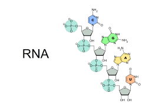
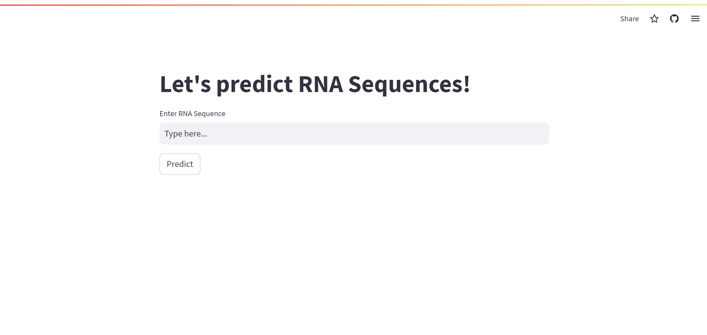
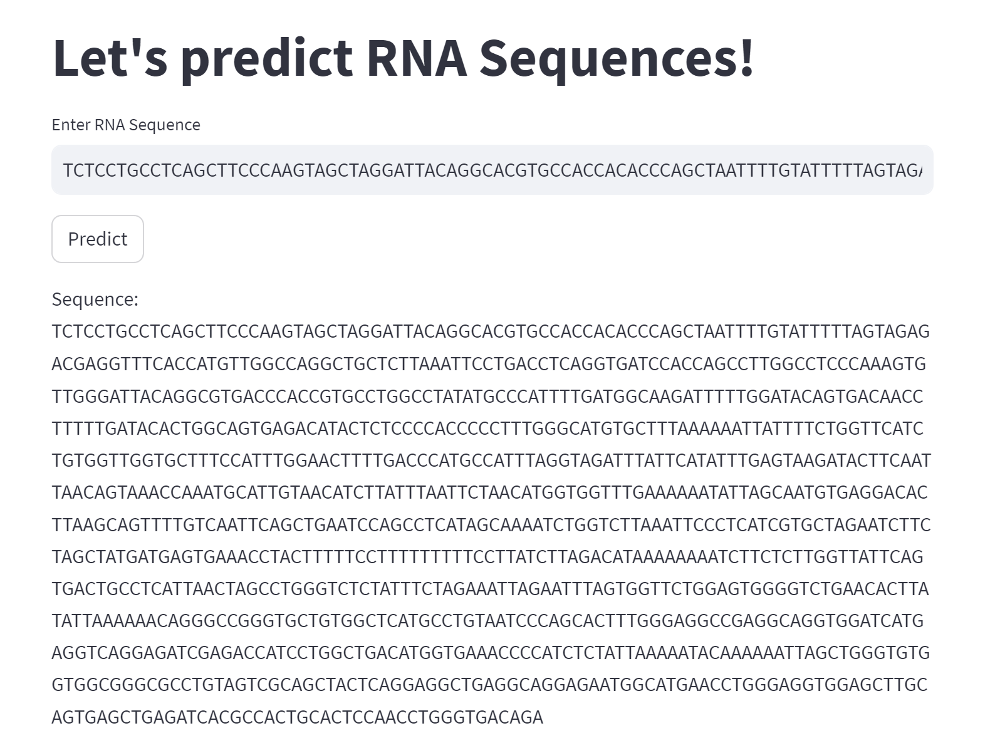
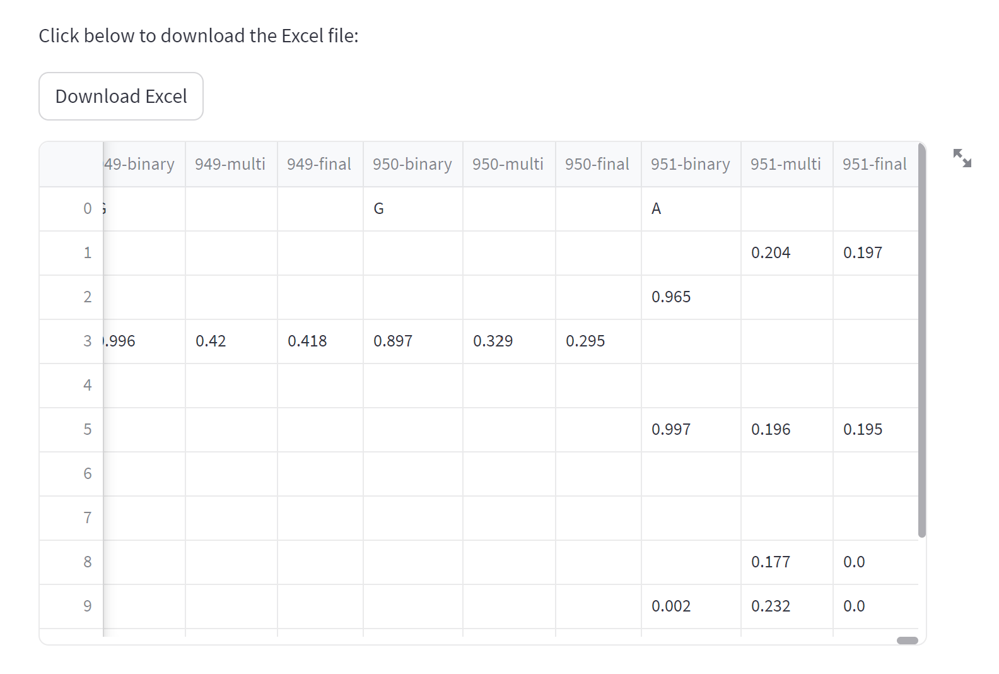
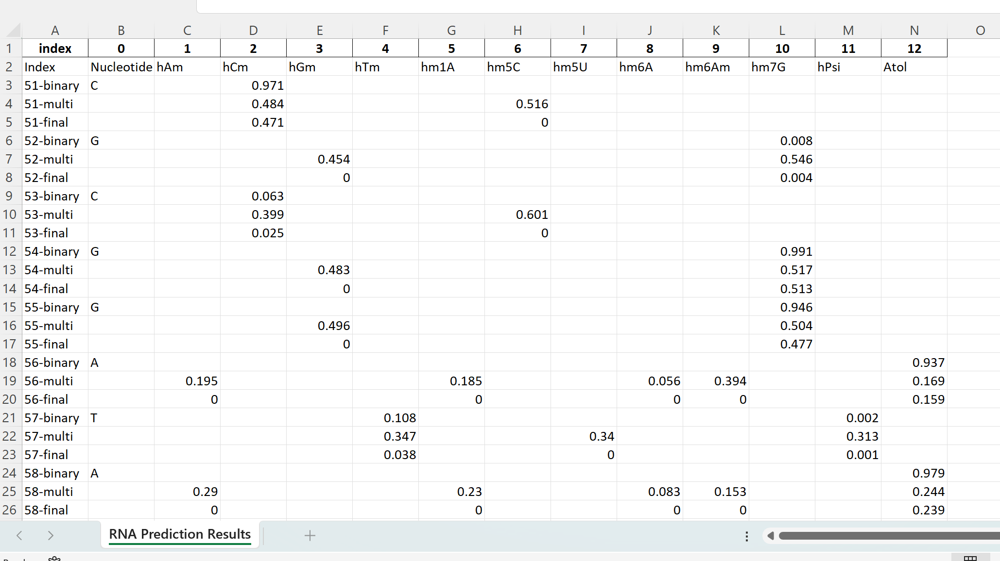

# RNA Prediction Modification

Welcome to the RNA Prediction Modification project! This repository aims to provide an introduction and guide to understanding RNA prediction modification using our solution. This project is designed by us, the RNAModX team, to help you predict if the RNA sequence is modified, and the position of the RNA Modification.

## Table of Contents

- [Introduction to RNA Prediction](#introduction-to-rna-prediction)
- [Getting Started](#getting-started)
- [Prerequisites](#prerequisites)
- [Installation](#installation)
- [Usage](#usage)
- [Examples](#examples)
- [Advanced Techniques](#advanced-techniques)
- [Contributing](#contributing)
- [License](#license)

## Introduction to RNA Prediction

RNA (Ribonucleic Acid) is a vital molecule involved in various biological processes, including gene expression, regulation, and protein synthesis.

## Getting Started

Before you dive into RNA prediction and modification, make sure you have a clear understanding of the prerequisites and installation steps.

## Prerequisites

To follow along with this project, you'll need:

- Basic understanding of molecular biology concepts.
- Familiarity with programming and command-line tools (ie. Powershell).
- A code editor (Intellij or Visual Studio) for viewing and editing scripts.

## Installation

1. Clone this repository to your local machine using: https://github.com/shashivish/RNA-ModX.git
2. Navigate to the project directory: RNAModXApp
3. Install the required libraries and dependencies: pip install -r requirements.txt
4. Run the command: streamlit run main.py

## Example

1. The UI looks like this: 
2. Key in RNA sequence: GGGGCCGTGGATACCTGCCTTTTAATTCTTTTTTATTCGCCCATCGGGGCCGCGGATACCTGCTTTTTATTTTTTTTTCCTTAGCCCATCGGGGTATCGGATACCTGCTGATTCCCTTCCCCTCTGAACCCCCAACACTCTGGCCCATCGGGGTGACGGATATCTGCTTTTTAAAAATTTTCTTTTTTTGGCCCATCGGGGCTTCGGATA
3. Click 'Predict'
4. Results look like this: 
   
5. Click on 'Download Excel' to view the results in excel file
   

## Accessibility
The RNA Modification application can be accessed at: https://rna-modx.streamlit.app/

## Contributing

Contributions to this project are welcome! If you find any issues, have suggestions, or want to add new features, feel free to open issues and pull requests.

## License

This project is licensed under the NUS ISS 2023 Capstone Team.
